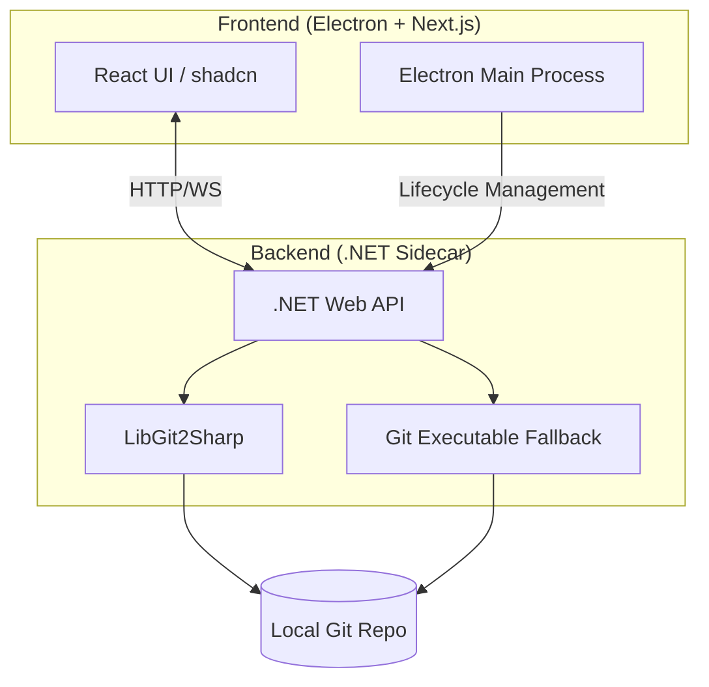

# GitForge Architecture

## Overview
GitForge is built using a decoupled architecture to balance UI flexibility with robust Git performance.

## Core Components

### 1. Frontend: Electron + Next.js
- **Technology:** Next.js (React), Tailwind CSS, shadcn/ui.
- **Role:** Handles all user interactions, visualizes the branch graph (using D3.js or SVG), and manages the desktop window.
- **Communication:** Sends requests to the .NET sidecar via localhost.

### 2. Backend: .NET Sidecar
- **Technology:** .NET 10 (Web API).
- **Role:** Executes Git commands using **LibGit2Sharp** for speed and reliability. For operations not natively supported by LibGit2Sharp (like some complex LFS or niche SSH flows), it falls back to calling the system `git` CLI.
- **Hosting:** Self-contained executable bundled within the Electron app.

### 3. IPC & Lifecycle
- Electron's Main Process is responsible for:
    - Starting the .NET executable on app launch.
    - Stopping the .NET executable on app close.
    - Providing the API port/URL to the Next.js renderer.

## Security
- **Credential Storage:** Uses OS-native stores (macOS Keychain, Windows Credential Manager) via .NET.
- **Communication:** Restricted to local loopback (localhost).
