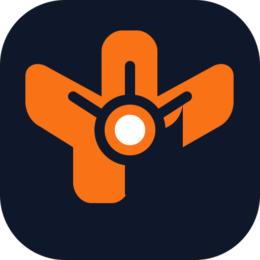

# GitForge

**GitForge** is a modern, AI-powered Git client built with web technologies. It combines the performance of a native application with the flexibility of the modern web stack.



## 🚀 Key Features

*   **🤖 AI Commit Assistant**: Generate semantic commit messages automatically from your changes using OpenAI or Gemini.
*   **📊 Interactive Graph**: Visualize your commit history with a beautiful "Metro Map" style graph.
*   **📝 Enhanced Diff & Patch**:
    *   **Side-by-Side** & **Inline** Diff Views with syntax highlighting.
    *   **Image Diffing**: Swipe, Onion Skin, and Side-by-Side comparison for assets.
    *   **Patch Mode**: Stage specific lines or hunks of code interactively.
*   **📦 Advanced Stashing**: Stash individual files or manage your stash list with ease.
*   **💻 Integrated Terminal**: Built-in terminal panel for quick CLI commands without leaving the app.
*   **🔍 Fuzzy File Search**: Instantly jump to any file in your repository (`Cmd+P`).
*   **🐙 GitHub Integration**: View Pull Requests, Issues, and CI/CD Build Statuses directly in the graph.

## 🛠️ Development

To start the application in development mode:

```bash
# Install dependencies
npm install

# Run development server (Next.js + Electron)
npm run dev
```

**Note:** In development mode (`npm run dev`), the application menu bar on macOS will display **"Electron"** instead of "GitForge". This is a standard behavior of the Electron runner. To see the correct branding, you must build the application for production.

## 📦 Production Build

To create a standalone application package (e.g., `.dmg` for macOS, `.exe` for Windows, or `.AppImage` for Linux):

```bash
# Build the application
npm run dist
```

This command will:
1.  Build the Next.js application.
2.  Package the Electron app using `electron-builder`.
3.  Output the installers to the `dist/` directory.

**Why build?**
-   **Correct Branding**: The menu bar will correctly show **"GitForge"**.
-   **Performance**: The app runs optimized production code.
-   **Portability**: You get a single installable file.

## 🏗️ Tech Stack

*   **Framework**: [Electron](https://www.electronjs.org/) + [Next.js](https://nextjs.org/)
*   **UI Library**: [React](https://react.dev/) + [Shadcn/UI](https://ui.shadcn.com/)
*   **Styling**: [Tailwind CSS](https://tailwindcss.com/)
*   **Editor**: [Monaco Editor](https://microsoft.github.io/monaco-editor/) (Diff View)
*   **Terminal**: [xterm.js](https://xtermjs.org/)
*   **Drag & Drop**: [dnd-kit](https://dndkit.com/)

## 📄 License

Private / Proprietary